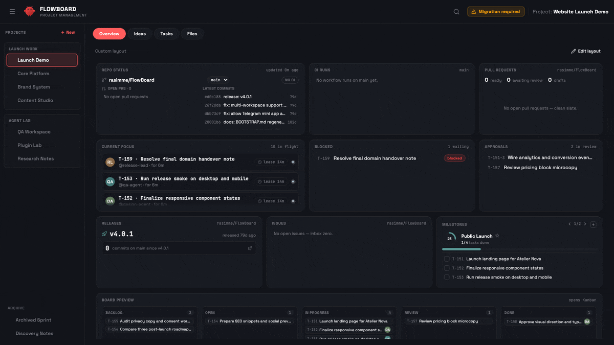
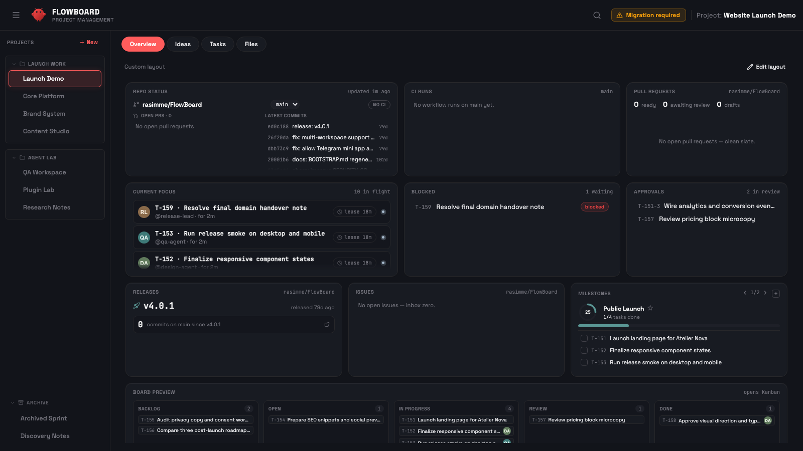
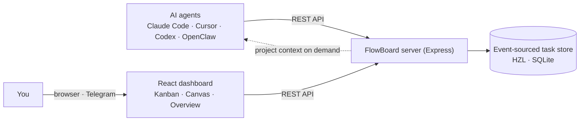

<h1 align="center">FlowBoard</h1>

<p align="center">
  <strong>Project workspaces for AI agents. Built for <a href="https://github.com/openclaw/openclaw">OpenClaw</a> and external coding agents.</strong>
</p>

<p align="center">
  <a href="https://github.com/rasimme/FlowBoard/blob/main/LICENSE"></a>
  <a href="https://github.com/rasimme/FlowBoard/releases"></a>
  <a href="https://github.com/rasimme/FlowBoard"></a>
</p>

<p align="center">
  <a href="#quick-start">Quick Start</a> •
  <a href="#features">Features</a> •
  <a href="#-idea-canvas">Idea Canvas</a> •
  <a href="#remote-access-telegram-mini-app">Remote Access</a> •
  <a href="docs/README.md">Docs</a> •
  <a href="CHANGELOG.md">Changelog</a>
</p>

---

Your agent loses context every session. What was I building? What decisions did I make? What's the next task? All gone.

**FlowBoard fixes that.**

- **📂 Project context on demand** — Activate a project and your agent gets goals, decisions, live task state, and specs. Lazy-loaded to save tokens.
- **📋 Kanban you both use** — Your agent creates tasks, writes specs, claims work, checkpoints progress, and moves cards through review. You see the full multi-agent workflow live.
- **💡 Idea Canvas** — Brainstorm together visually. One click turns connected ideas into tasks with specs and subtasks.



---

## Why FlowBoard?

The real problem isn't a missing task board — it's that your agent starts every session blank. Across several projects, you re-explain the goal, the decisions, and where things stand, again and again.

FlowBoard is a **context layer for your projects.** Each project keeps its goal, decisions, live task state, and specs in one place, and your agent pulls in exactly the slice it needs, when it needs it — **lazy-loaded, so token usage stays low.** Switch projects and the right context follows; nothing to re-explain.

Everything else builds on that layer:

- **Agent-native Kanban** — tasks, specs, claims, checkpoints, and review, so "where things stand" is always live instead of narrated.
- **Idea Canvas** — brainstorm visually, then promote connected notes straight into tasks and specs.
- **Modular Overview** — a per-project dashboard that surfaces the context that matters at a glance.
- **Built for many agents** — stable identity, claims, and a live multi-agent view, for OpenClaw and external agents alike.

It's local-first: everything runs on your machine, event-sourced in SQLite — no SaaS, no account, and your project names stay on your box.

---

## Features

### 📂 Project Workspaces

Activate a project and the agent gets the context it needs — goal, scope, architecture, decisions, current task state, specs. Everything is loaded on demand: the agent pulls in what it needs, when it needs it, keeping token usage low. Switch between projects without losing track.

- Structured project files: `PROJECT.md` → `DECISIONS.md` → `specs/` (canvas lives in the database since ADR-0025)
- HZL-backed task runtime with claims, leases, checkpoints, comments, and review gates
- Lazy loading — zero overhead when no project is active
- Session handoff — pick up exactly where you left off

### 🧩 Modular Project Overview

Every project gets a composable landing page: a widget grid both you and
your agents can shape. 26 widgets across five clusters — what needs you
(blocked, approvals, open agent questions), live activity and momentum,
direction (milestones as definition-of-done checklists, stats, board
preview), a full GitHub family (repo status, CI history, PRs, releases,
issues — one repo binding per project, token optional for private
repos), and knowledge (file viewer, context index, notes, quick links).
Drag-and-drop editing with presets, or let the agent compose it via the
same REST API:

```
PUT /api/projects/:name/overview   { version: 1, layout: "grid", widgets: [...] }
PUT /api/projects/:name/overview   { "preset": "coding" }
```



### 📋 Agent-Native Kanban

Your agent operates the board through the same REST API as the dashboard. It creates tasks, sets priorities, writes specs with acceptance criteria, claims work with leases, checkpoints progress, and hands completed work to review.

- Tasks with workflow: `backlog → open → in-progress → review → done`
- Parent tasks with subtasks, progress tracking, and automatic parent status updates
- Spec files with acceptance criteria and logs
- Multi-agent visibility: active agents, claimed cards, checkpoints, comments, and review approvals


### 💡 Idea Canvas

A node-based brainstorming space. Sticky notes with connections form clusters. One click sends them to your agent, who analyzes the ideas and creates:


- **Simple idea** → Task with title and priority
- **Detailed idea** → Task + spec with acceptance criteria
- **Complex cluster** → Parent task + subtasks with specs

Visual brainstorming → structured tasks, zero manual overhead.

### 📁 File Explorer

Browse, preview, and edit project files without leaving the dashboard. Markdown rendering, a CodeMirror-powered editor, spec files, context uploads, and auto-refresh keep the project workspace inspectable without dropping to a shell.


### 📱 Telegram Mini App

Access FlowBoard remotely from Telegram. Secure authentication via HMAC-SHA256, mobile-optimized UI, works through Cloudflare Tunnel, ngrok, or Tailscale.

---

## Quick Start

**Two commands, then open the dashboard:**

```bash
openclaw plugins install flowboard   # wires the project-context hook
node scripts/setup.mjs               # build the UI + run the dashboard as a per-user service
```

Open **http://localhost:18790**, click the **Finish setup** chip in the header, then tell your agent *“New project: my-app”*. Done — the rest of this section is detail.

> **Prerequisites:** Node.js ≥ 18 and `npm` on your `PATH`. The `openclaw plugins install` path also needs **OpenClaw ≥ 2026.6.6** — the dashboard runs standalone, but the project-context hook requires OpenClaw.

### Already installed as an OpenClaw plugin?

`openclaw plugins install flowboard` wires the project-context hook. To bring
up the dashboard in one step — install deps, build the UI, register a
per-user service (launchd/systemd) and verify health:

```bash
node scripts/setup.mjs          # or: npm run setup
node scripts/setup.mjs --dry-run   # preview, change nothing
```

Re-run with `--update` after `openclaw plugins update` to rebuild & restart.
Prefer the manual path? It's below.

### Updating

After `openclaw plugins update flowboard` the new plugin source is on disk but
the running dashboard still serves the previous build. Two ways to apply it:

- **From the dashboard (recommended).** The header **Update** panel
  (SnippetUpgrade) detects the version mismatch and shows an *“Update available ·
  vX → vY”* chip. Click **Update & restart** — it runs `setup.mjs --update`
  (reinstall deps + rebuild UI + restart the service, leaving your `.env` and
  data untouched), then reloads the page onto the new build. Backed by
  `GET /api/update/status` and `POST /api/update/run`.
- **From the CLI.** `node scripts/setup.mjs --update` from the FlowBoard checkout
  does the same rebuild + restart.

> **Custom service or supervisor?** The in-UI update manages the standard per-user service — `ai.openclaw.flowboard-dashboard` (launchd) / `flowboard-dashboard` (systemd `--user`). If you run the dashboard under your own supervisor or a different label, don't use the in-UI update (it would collide on port 18790) — update with `node scripts/setup.mjs --update` from the checkout, or move your service to the standard label.

> **Upgrading to 5.0.0:** the canvas DB schema is created automatically, but importing existing `canvas.json` data is operator-triggered — via the in-app banner, `POST /api/migrations/canvas/run`, or `node dashboard/scripts/migrate-canvas-to-db.mjs --run`. Non-blocking; see the [migrations reference](docs/reference/api/migrations.md).

<details>
<summary><strong>Manual install (without the plugin)</strong></summary>

### 1. Clone & install (manual)

```bash
git clone https://github.com/rasimme/FlowBoard.git
cd FlowBoard/dashboard
npm install
npm run build   # builds the dashboard UI into dist/ (served by the server)
```

### 2. Register the hook with OpenClaw

FlowBoard ships as an OpenClaw hook pack (declared via `package.json` →
`openclaw.hooks`). Register it through OpenClaw's plugin lifecycle so the
gateway runs `project-context` before every agent run (covering `/new`,
`/reset`, gateway startup, daily reset, idle expiry, and project switch
via `PUT /api/status`):

```bash
openclaw plugins install ~/repos/FlowBoard --link
openclaw config set hooks.internal.load.extraDirs '["~/repos/FlowBoard/hooks"]' --merge
openclaw gateway restart
```

`--link` keeps the hook pointing at this checkout, so `git pull` propagates
hook changes without a re-install. The second command (`extraDirs`) is
currently required because OpenClaw's runtime hook discovery doesn't yet
read the `--link` install record directly — once the upstream gap is
closed, this step becomes optional.

Verify the hook is registered:

```bash
openclaw hooks info project-context
# Expect: ✓ Ready, source openclaw-managed, subscribed to agent:bootstrap
```

#### Upgrading from earlier FlowBoard versions

Versions before this change shipped a `scripts/install-hooks.sh` script
that symlinked or copied the hook into `~/.openclaw/hooks/project-context/`.
The new install path replaces that — remove the legacy hook directory once
before running the commands above:

```bash
rm -rf ~/.openclaw/hooks/project-context
```

If you previously edited `~/.openclaw/openclaw.json` to register the hook
manually, no extra cleanup is needed — `openclaw config set --merge` keeps
existing entries intact.

### 3. Start the dashboard

Migrations run automatically on server start (HZL project metadata,
per-agent active-project DB setup, PROJECT-RULES canonical-path symlink,
legacy-snippet advisory).

The server stores shared project data under `FLOWBOARD_PROJECTS_DIR` when set,
or `<OPENCLAW_HOME>/projects` by default. `OPENCLAW_WORKSPACE` is still
accepted for older installs and for the HZL DB default.

```bash
node server.js
# Optional custom locations:
# OPENCLAW_HOME=/path/to/.openclaw FLOWBOARD_PROJECTS_DIR=/path/to/projects node server.js

# Or with systemd (auto-start on boot):
cp templates/dashboard.service ~/.local/share/systemd/user/
systemctl --user enable --now dashboard
```

### 4. Finish setup in the dashboard

Open **http://localhost:18790**. If any workspace needs setup, a
**Finish setup** (fresh install) or **Migration required** (upgrade from
an older FlowBoard) chip appears in the header. Click it to open the
setup modal and choose per workspace:

- **Upgrade** — byte-identical legacy snippets → new canonical block
- **Migration required** — user-edited legacy blocks → force-replace (per-file opt-in)
- **Add FlowBoard to workspace** — workspace doesn't have the snippet yet → append it
- **Dismiss** — this workspace shouldn't use FlowBoard (e.g. a voice agent)

Every change writes a `.bak-<timestamp>` copy first. If you prefer the
CLI path: `node dashboard/snippets-doctor.js` does the same detection
and `--apply` upgrades byte-identical blocks only.

The migration modal also shows display-only advisories for legacy
project-state files and OpenClaw config/runtime leftovers. After changing
OpenClaw config such as `memoryFlush`, restart the OpenClaw gateway/runtime;
already-running processes can keep the old compaction prompt in memory.

### 5. Create your first project

Once the chip disappears, tell your agent:

> "New project: my-app"

The agent creates the project through `POST /api/projects`, registers it in
FlowBoard metadata/HZL, and uses the Tasks API for operational task state.

</details>

---

## Canvas → Task Promote

Since v5, promoting canvas notes to tasks works out of the box: selecting
notes and clicking **Create Task** opens the Specify stepper in the dashboard
— clarification questions, proposal review, and task creation all happen in
the browser, with no webhook or agent configuration required.

OpenClaw webhooks are only needed for the **chat-agent path** (scripted
callers passing an explicit `agentId`, so a chat-bound agent runs the
clarification conversation instead of the dashboard stepper):

**1. Enable webhooks** in `~/.openclaw/openclaw.json`:
```json5
{
  hooks: {
    enabled: true,
    token: "your-secret-token",  // openssl rand -hex 16
    path: "/hooks"
  }
}
```

**2. Set environment variables:**
```bash
OPENCLAW_HOOKS_TOKEN=your-secret-token
OPENCLAW_GATEWAY_URL=http://127.0.0.1:18789
OPENCLAW_DELIVER_CHANNEL=telegram        # or: discord, slack, etc.
OPENCLAW_DELIVER_TO=your-chat-id         # optional
```

Without these, everything works — including canvas promote via the dashboard stepper; only the chat-agent promote path is unavailable.

---

## Commands

Tell your agent:

| Command | What it does |
|---------|-------------|
| `Project: [Name]` | Activate project (loads full context) |
| `New project: [Name]` | Create project with folder structure |
| `End project` | Deactivate, save session summary |
| `Projects` | List all projects |

The agent also handles these autonomously while working:

| Action | What happens |
|--------|-------------|
| Create task | Agent calls API, sets priority, optionally writes spec |
| Create subtasks | Agent breaks a task into subtasks with a parent |
| Update status | Agent moves tasks through `backlog → open → in-progress → review → done` |
| Write spec | Agent creates `specs/T-xxx-slug.md` with acceptance criteria |
| Canvas promote | Agent receives cluster notes, decides task structure |

---

## Using FlowBoard with external agents (Codex, Cursor, Claude Code, …)

FlowBoard is designed for OpenClaw-managed agents *and* for external
runtimes that talk to the API directly. External agents are first-class:
they self-register on the first `PUT /api/status`, appear in the dashboard
agent list, and use the same task workflow as OpenClaw agents.

What's different for external agents: there is no live-injected
`BOOTSTRAP.md` in your run context (that mechanism is OpenClaw-runtime
specific). Instead, fetch the project context on demand via
`GET /api/projects/<project>/bootstrap`.

### Install the trigger snippet in your project repo

Run once per repo where you want an external agent to use FlowBoard:

```bash
node ~/repos/FlowBoard/dashboard/install-trigger.mjs --repo ~/myrepo
```

This adds the FlowBoard external-trigger block to `myrepo/AGENTS.md`
(idempotent — re-run anytime to refresh) and creates `myrepo/CLAUDE.md`
as a symlink to `AGENTS.md` so Claude Code reads the same content.
Use `--no-symlink` on filesystems without symlink support (Windows,
sync-mounted drives); the installer falls back to a copy.

To remove the block later:

```bash
node ~/repos/FlowBoard/dashboard/install-trigger.mjs --repo ~/myrepo --uninstall
```

### Discovery without the installer

The same content is served by the dashboard for tooling or quick
inspection:

```bash
curl http://localhost:18790/api/info
```

Returns service metadata, the API endpoint list, and the trigger
snippet as `trigger_snippet`. No auth is required — discovery happens
before identity. Suitable for users who prefer to copy-paste into a
specific config file (`.cursorrules`, `CONVENTIONS.md`, etc.) instead
of `AGENTS.md`.

### Identity convention

Pick a stable agent-id for your runtime:

| Runtime | Suggested agent-id |
|---|---|
| Claude Code | `claude-code` |
| Codex | `codex` |
| Cursor | `cursor` |
| Aider | `aider` |
| Custom script | a stable string of your choice |

Add a host suffix (`codex-laptop`, `claude-code-jetson`) if you run
multiple parallel instances. The agent-id is a freeform string —
auto-registered in `flowboard_agents` on the first `PUT /api/status`.
Keep it stable across the session so the dashboard shows clean
attribution.

---

<details>
<summary><h2>Remote Access (Telegram Mini App)</h2></summary>

FlowBoard can be accessed remotely as a Telegram Mini App through a secure tunnel.

### Set up a tunnel

Any tunnel works. Recommended: **Cloudflare Tunnel** (free, stable).

```bash
cloudflared tunnel login
cloudflared tunnel create flowboard
cloudflared tunnel route dns flowboard flowboard.example.com
cp templates/cloudflare-config.yml ~/.cloudflared/config.yml
# Edit: replace placeholder values
cloudflared tunnel run flowboard
```

### Configure authentication

```bash
JWT_SECRET=$(openssl rand -hex 32)

mkdir -p ~/.config/systemd/user/dashboard.service.d
cp templates/systemd-auth.conf.example \
   ~/.config/systemd/user/dashboard.service.d/auth.conf
# Edit with your values:
# - TELEGRAM_BOT_TOKEN (from @BotFather)
# - JWT_SECRET
# - ALLOWED_USER_IDS (comma-separated allowed user ids)
# - DASHBOARD_ORIGIN (your public URL)

systemctl --user daemon-reload
systemctl --user restart dashboard
```

### Register Telegram button

1. Open @BotFather → `/setmenubutton`
2. Select your bot
3. Send your public dashboard URL
4. Send button label (e.g. "Dashboard")

</details>

---

## Architecture

How the pieces fit — you and your agents drive the same server, the single writer of an event-sourced task store, which feeds project context back to agents on demand:



Directory layout:

```
~/.openclaw/workspace-<agent>/
├── AGENTS.md                     # Minimal FlowBoard trigger — status check + lazy load
├── BOOTSTRAP.md                  # OpenClaw-owned runtime bootstrap; FlowBoard does not write this
└── (ACTIVE-PROJECT.md)           # Legacy artifact; ignored unless migration fallback is explicitly enabled

~/.openclaw/projects/             # Shared project data (or FLOWBOARD_PROJECTS_DIR)
└── my-project/
    ├── PROJECT.md                # Stable project map, not current task truth
    ├── SESSIONS.md               # Chronological session log
    ├── DECISIONS.md              # Architecture + design rationale
    ├── context/                  # External reference docs
    └── specs/                    # Task specs

~/.openclaw/workspace/.hzl/       # Coordination backend by default (or HZL_DB_PATH)
├── flowboard.db                  # HZL event store — tasks, claims, checkpoints, comments
└── flowboard-cache.db            # Projections + flowboard_projects, flowboard_agents

~/repos/FlowBoard/                # SSoT — pulled from dev branch on GitHub
├── dashboard/
│   ├── server.js                 # Express 5 API + auth
│   ├── rules-api.js              # Lazy-load rules registry + manifest
│   ├── snippets-doctor.js        # Installer / migrator (state machine)
│   ├── src/                      # React + Vite + Tailwind UI
│   └── styles/dashboard.css      # Global component styles + design tokens (CSS custom properties), loaded by index.html
├── docs/project-mode/            # Rule sections served via /api/projects/:name/rules/:section
│   ├── commands.md / tasks-api.md / hzl.md / canvas-and-notes.md
│   ├── project-files.md / specify-workflow.md / agent-bridge.md
│   ├── error-handling.md / key-principles.md
├── snippets/
│   ├── AGENTS-trigger.md         # Minimal trigger block for AGENTS.md
│   ├── external-trigger.md       # Minimal trigger for external agents
│   └── legacy/*.v*.md            # Vendored legacy copies for byte-match/fingerprint detection
└── hooks/project-context/        # Keeps project status available; agents fetch context lazily
```

**Key principles:**
- 📡 **DB-canonical** — project + per-agent state live in `flowboard_agents` / `flowboard_projects`
- 🧩 **Lazy-load rules** — agent checks `/api/status`, then fetches bootstrap/rules on demand
- 🔒 **Local-first** — everything runs on your machine; public remote access is opt-in
- 🧪 **API-driven** — dashboard and agents share the same REST surface

---

## Documentation

Full documentation lives in [`docs/`](docs/README.md) — organized by audience:

- [User guide](docs/guide/) — install, search, mobile use, managing projects
- [Concepts](docs/concepts/) & [ADRs](docs/adr/) — how and why it works
- [Reference](docs/reference/) — API manifest & environment variables

## Contributing

Contributions welcome! See [CONTRIBUTING.md](CONTRIBUTING.md) for guidelines.

```bash
git checkout -b feat/your-feature
# Make changes on dev branch
git commit -m "feat: your feature"
```

---

## License

MIT © 2026

---

<p align="center">
  <strong>Built with ❤️ for the <a href="https://github.com/openclaw/openclaw">OpenClaw</a> community</strong>
</p>
