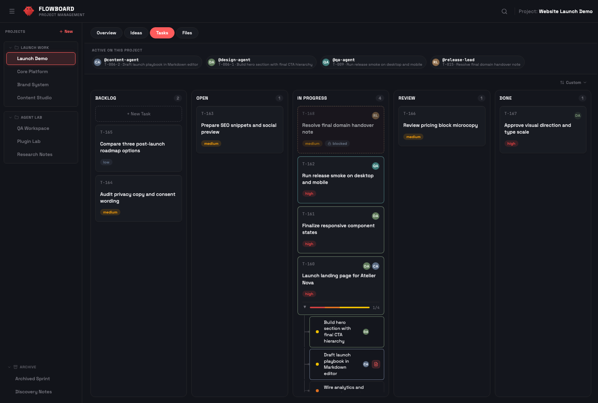
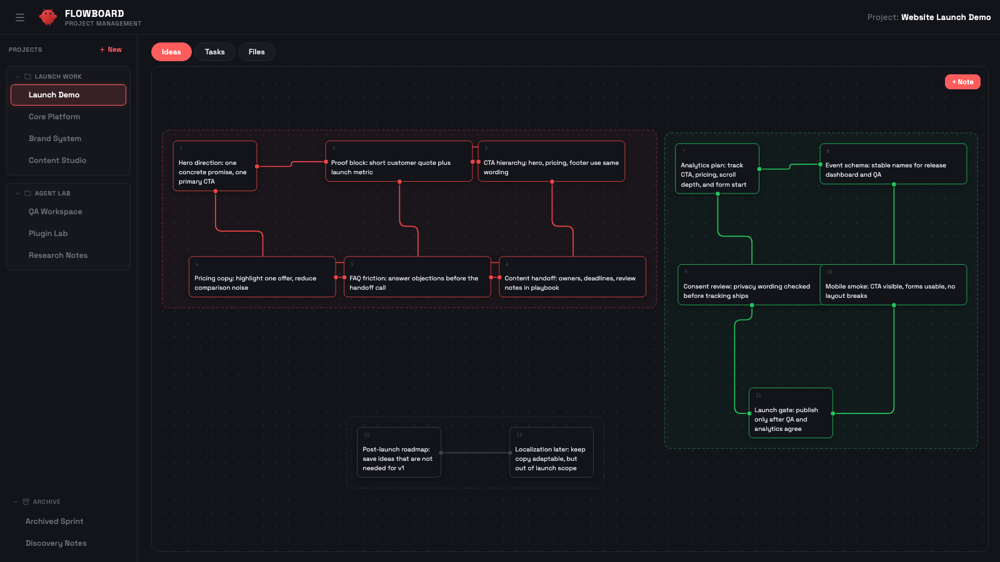
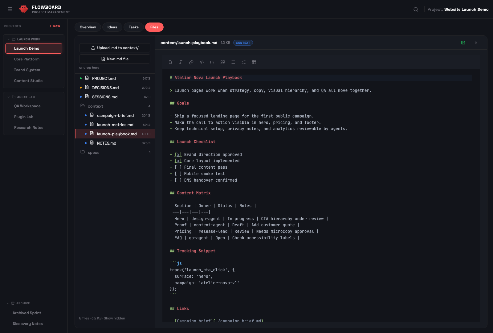

<h1 align="center">FlowBoard</h1>

<p align="center">
  <strong>Project management for AI agents. Built for <a href="https://github.com/openclaw/openclaw">OpenClaw</a>.</strong>
</p>

<p align="center">
  <a href="https://github.com/rasimme/FlowBoard/blob/main/LICENSE"></a>
  <a href="https://github.com/rasimme/FlowBoard/releases"></a>
  <a href="https://github.com/rasimme/FlowBoard"></a>
</p>

<p align="center">
  <a href="#quick-start">Quick Start</a> •
  <a href="#features">Features</a> •
  <a href="#idea-canvas">Idea Canvas</a> •
  <a href="#remote-access">Remote Access</a> •
  <a href="CHANGELOG.md">Changelog</a>
</p>

---

Most project management tools are built for humans. Your AI agent can't use Trello. It can't drag cards in Notion. It can't update Jira.

**FlowBoard is different.** Your AI agent creates tasks, writes specs, updates status, and breaks down work into subtasks — autonomously. You see everything live on a Kanban board.

> Other tools: *"AI helps you manage tasks."*
> FlowBoard: *"Your AI agent manages tasks. You watch."*



---

## Features

### 📋 Agent-Native Task Management

Your OpenClaw agent doesn't just assist — it operates the board. It creates tasks, sets priorities, writes detailed specs, and moves cards through the workflow. Parent tasks with subtasks, progress tracking, priority pills — all managed by the agent, visible to you in real-time.

- Tasks with structured workflow: `open → in-progress → review → done`
- Parent tasks with subtasks and progress bars
- Spec files with acceptance criteria and logs
- Agent updates status as it works — you see progress live

### 💡 Idea Canvas → Task Pipeline

Brainstorm visually. Connect ideas. Let the agent do the rest.



The Idea Canvas is a node-based brainstorming space (inspired by [ComfyUI](https://github.com/comfyanonymous/ComfyUI)). Sticky notes with connections form clusters. One click sends them to your agent, who analyzes the ideas and autonomously creates:

- **Simple idea** → Task with title and priority
- **Detailed idea** → Task + spec file with acceptance criteria
- **Complex cluster** → Parent task + subtasks with specs

No other project management tool converts visual brainstorming into structured tasks with AI — zero manual overhead.

### 📁 File Explorer

Browse, preview, and edit project files without leaving the dashboard. Markdown rendering with syntax highlighting, inline editing, and auto-refresh.



### 📱 Telegram Mini App

Access FlowBoard remotely from Telegram. Secure authentication via HMAC-SHA256, mobile-optimized UI, works through Cloudflare Tunnel, ngrok, or Tailscale.

---

## Quick Start

### 1. Clone & install

```bash
git clone https://github.com/rasimme/FlowBoard.git
cd FlowBoard/dashboard
npm install
```

### 2. Set up workspace

```bash
cp FlowBoard/files/ACTIVE-PROJECT.md ~/.openclaw/workspace/
cp -r FlowBoard/files/projects ~/.openclaw/workspace/
```

### 3. Add agent trigger

Add the project trigger to the top of your `~/.openclaw/workspace/AGENTS.md`:

```bash
cat FlowBoard/snippets/AGENTS-trigger.md
# → Paste that block into your AGENTS.md
```

### 4. Install hooks

```bash
cp -r FlowBoard/hooks/project-context ~/.openclaw/hooks/
cp -r FlowBoard/hooks/session-handoff ~/.openclaw/hooks/
openclaw gateway restart
```

### 5. Start the dashboard

```bash
node server.js
# Or with systemd (auto-start on boot):
cp templates/dashboard.service ~/.local/share/systemd/user/
systemctl --user enable --now dashboard
```

### 6. Create your first project

Open **http://localhost:18790** and tell your agent:

> "New project: my-app"

The agent creates the folder structure, task file, and registers it in the dashboard.

---

## Canvas → Task Promote

The Idea Canvas promote feature requires OpenClaw webhooks:

**1. Enable webhooks** in `~/.openclaw/openclaw.json`:
```json5
{
  hooks: {
    enabled: true,
    token: "your-secret-token",  // openssl rand -hex 16
    path: "/hooks"
  }
}
```

**2. Set environment variables:**
```bash
OPENCLAW_HOOKS_TOKEN=your-secret-token
OPENCLAW_GATEWAY_URL=http://127.0.0.1:18789
OPENCLAW_DELIVER_CHANNEL=telegram        # or: discord, slack, etc.
OPENCLAW_DELIVER_TO=your-chat-id         # optional
```

Without these, everything works except canvas promote.

---

## Commands

| Command | What it does |
|---------|-------------|
| `Project: [Name]` | Activate project (loads full context) |
| `New project: [Name]` | Create project with folder structure |
| `End project` | Deactivate, save session summary |
| `Projects` | List all projects |

---

<details>
<summary><h2>Remote Access (Telegram Mini App)</h2></summary>

FlowBoard can be accessed remotely as a Telegram Mini App through a secure tunnel.

### Set up a tunnel

Any tunnel works. Recommended: **Cloudflare Tunnel** (free, stable).

```bash
cloudflared tunnel login
cloudflared tunnel create flowboard
cloudflared tunnel route dns flowboard dashboard.your-domain.com
cp templates/cloudflare-config.yml ~/.cloudflared/config.yml
# Edit: replace <TUNNEL_ID>, <USER>, <YOUR_DOMAIN>
cloudflared tunnel run flowboard
```

### Configure authentication

```bash
JWT_SECRET=$(openssl rand -hex 32)

mkdir -p ~/.config/systemd/user/dashboard.service.d
cp templates/systemd-auth.conf.example \
   ~/.config/systemd/user/dashboard.service.d/auth.conf
# Edit with your values:
# - TELEGRAM_BOT_TOKEN (from @BotFather)
# - JWT_SECRET
# - ALLOWED_USER_IDS (your Telegram user ID)
# - DASHBOARD_ORIGIN (your public URL)

systemctl --user daemon-reload
systemctl --user restart dashboard
```

### Register Telegram button

1. Open @BotFather → `/setmenubutton`
2. Select your bot
3. Send your public dashboard URL
4. Send button label (e.g. "Dashboard")

</details>

---

## Architecture

```
~/.openclaw/workspace/
├── AGENTS.md                     # Agent trigger
├── ACTIVE-PROJECT.md             # Current project state
└── projects/
    ├── PROJECT-RULES.md          # System rules
    ├── _index.md                 # Project registry
    └── my-project/
        ├── PROJECT.md            # Goal, scope, status, session log
        ├── DECISIONS.md          # Architecture decisions
        ├── tasks.json            # Tasks (API-managed)
        ├── canvas.json           # Idea canvas data
        ├── context/              # External references
        └── specs/                # Task specs

~/FlowBoard/dashboard/            # Dashboard server
├── server.js                     # Express 5 API + auth
├── index.html                    # SPA shell
├── js/                           # ES modules (vanilla JS, no build step)
└── styles/                       # CSS (dark theme)
```

**Key principles:**
- 🎯 **Vanilla JS** — No framework, no build step, no bundler
- 💾 **File-based** — JSON + Markdown, no database
- ⚡ **Lazy loading** — Zero overhead when no project active
- 🔒 **Local-first** — Everything runs on your machine
- 📡 **API-driven** — Dashboard and agent use the same REST API

---

## Contributing

Contributions welcome! Please read the codebase conventions in `CLAUDE.md` before submitting PRs.

```bash
git checkout -b feat/your-feature
# Make changes on dev branch
git commit -m "feat: your feature"
```

---

## License

MIT © 2026

---

<p align="center">
  <strong>Built with ❤️ for the <a href="https://github.com/openclaw/openclaw">OpenClaw</a> community</strong>
</p>
